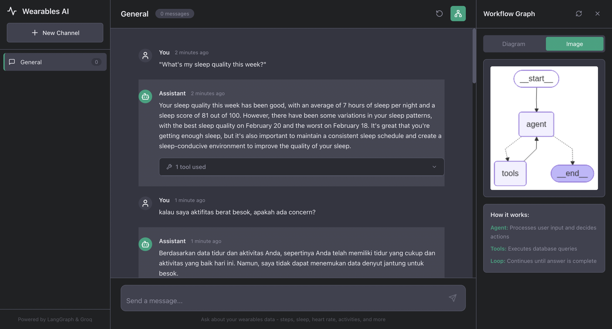

# Wearables Assistant - Microservices Architecture

> A modern full-stack application for querying wearables data using AI, built with FastAPI, React, and LangGraph.


## � Screenshot



## �📋 Table of Contents

- [Overview](#overview)
- [Architecture](#architecture)
- [Features](#features)
- [Tech Stack](#tech-stack)
- [Project Structure](#project-structure)
- [Installation](#installation)
- [Configuration](#configuration)
- [Running the Application](#running-the-application)
- [API Documentation](#api-documentation)
- [Frontend Guide](#frontend-guide)
- [Development](#development)
- [Deployment](#deployment)
- [Troubleshooting](#troubleshooting)
- [Contributing](#contributing)

---

## 🎯 Overview

Wearables Assistant is a conversational AI application that helps users query and analyze their wearable device data through natural language. The application uses a microservices architecture with a FastAPI backend and React frontend, powered by LangGraph for intelligent agent workflows.

### Key Capabilities

- 📊 **Natural Language Queries**: Ask questions in plain English
- 🤖 **Intelligent Agent**: LangGraph-powered workflow with tool calling
- 📈 **Comprehensive Data**: Steps, heart rate, sleep, activities, and more
- 🎨 **ChatGPT-like UI**: Modern, responsive interface
- 🔧 **Tool Transparency**: See exactly what tools are being called
- 📱 **Channel Management**: Organize conversations by topic
- 🌐 **Graph Visualization**: Understand the agent's decision process

---

## 🏗️ Architecture

### System Design

```
┌─────────────┐         ┌──────────────┐         ┌────────────────┐
│             │         │              │         │                │
│   React     │◄───────►│   FastAPI    │◄───────►│   LangGraph    │
│   Frontend  │   HTTP  │   Backend    │         │     Agent      │
│             │         │              │         │                │
└─────────────┘         └──────────────┘         └────────────────┘
                                │                         │
                                │                         │
                                ▼                         ▼
                        ┌──────────────┐         ┌────────────────┐
                        │              │         │                │
                        │   SQLite     │         │   Groq LLM     │
                        │   Database   │         │   (Llama 3.3)  │
                        │              │         │                │
                        └──────────────┘         └────────────────┘
```

### Component Flow

1. **User Interface (React)**
   - Modern ChatGPT-like interface
   - Real-time message updates
   - Tool execution display
   - Channel management
   - Graph visualization sidebar

2. **API Layer (FastAPI)**
   - RESTful endpoints
   - CORS-enabled
   - Request/response validation
   - Error handling
   - OpenAPI documentation

3. **Business Logic (Services)**
   - Agent service (LangGraph management)
   - Channel service (conversation management)
   - Graph service (visualization)

4. **AI Agent (LangGraph)**
   - State machine workflow
   - Tool selection and execution
   - Conversation context management

5. **Data Layer (SQLite)**
   - User profiles
   - Device information
   - Health metrics
   - Activity data

---

## ✨ Features

### 1. ChatGPT-like Interface

- **Modern Design**: Dark theme, smooth animations
- **Real-time Updates**: Instant message display
- **Markdown Support**: Formatted responses
- **Auto-scroll**: Always see latest messages
- **Typing Indicators**: Visual feedback during processing

### 2. Channel Management

- **Multiple Channels**: Organize conversations by topic
- **Channel Creation**: Easy channel creation with custom names
- **Channel Switching**: Quick navigation between channels
- **Message Counting**: See activity at a glance
- **Channel Deletion**: Clean up unused channels

### 3. Tool Execution Display

- **Inline Display**: Tools shown directly in chat
- **Expandable Details**: Click to see full information
- **Arguments Shown**: See exactly what was queried
- **Results Preview**: View tool execution results
- **Multiple Tools**: Support for complex multi-tool queries

### 4. Graph Visualization

- **Sidebar Panel**: Dedicated visualization area
- **Mermaid Diagrams**: Interactive workflow diagrams
- **PNG Export**: Optional image view
- **Workflow Explanation**: Understand agent decisions
- **Real-time Updates**: Refresh on demand

### 5. Data Querying

**Available Tools:**
- `daily_steps_tool`: Get step counts and activity
- `sleep_data_tool`: Analyze sleep patterns
- `heart_rate_tool`: View heart rate data
- `activity_history_tool`: Browse workouts
- `weekly_summary_tool`: Comprehensive reports
- `device_info_tool`: User and device information
- `date_range_search_tool`: Custom date queries

---

## 🛠️ Tech Stack

### Backend

| Technology | Version | Purpose |
|------------|---------|---------|
| **FastAPI** | 0.104+ | Web framework |
| **Uvicorn** | 0.24+ | ASGI server |
| **Pydantic** | 2.5+ | Data validation |
| **LangGraph** | 0.2+ | Agent workflows |
| **LangChain** | 0.3+ | LLM framework |
| **Groq** | 0.11+ | LLM provider |
| **SQLite** | 3.x | Database |
| **Pillow** | 10.0+ | Image processing |

### Frontend

| Technology | Version | Purpose |
|------------|---------|---------|
| **React** | 18.2 | UI framework |
| **Vite** | 5.0 | Build tool |
| **Axios** | 1.6 | HTTP client |
| **React Markdown** | 9.0 | Markdown rendering |
| **Lucide React** | 0.294 | Icons |
| **Mermaid** | 10.6 | Diagram rendering |
| **date-fns** | 2.30 | Date formatting |

---

## 📁 Project Structure

```
assistant-wearables/
├── backend/                    # FastAPI Backend
│   ├── app/
│   │   ├── api/               # API Routes
│   │   │   ├── chat.py        # Chat endpoints
│   │   │   ├── channels.py    # Channel management
│   │   │   └── graph.py       # Graph visualization
│   │   ├── core/              # Core functionality
│   │   │   └── config.py      # Configuration
│   │   ├── models/            # Pydantic models
│   │   │   └── schemas.py     # Request/response schemas
│   │   ├── services/          # Business logic
│   │   │   ├── agent_service.py
│   │   │   ├── channel_service.py
│   │   │   └── graph_service.py
│   │   └── main.py            # FastAPI app
│   └── requirements.txt       # Python dependencies
│
├── frontend/                   # React Frontend
│   ├── src/
│   │   ├── components/        # React components
│   │   │   ├── Sidebar.jsx    # Channel sidebar
│   │   │   ├── ChatArea.jsx   # Main chat interface
│   │   │   ├── MessageList.jsx
│   │   │   ├── Message.jsx    # Individual message
│   │   │   └── GraphPanel.jsx # Graph visualization
│   │   ├── hooks/             # Custom React hooks
│   │   │   ├── useChat.js
│   │   │   └── useChannels.js
│   │   ├── services/          # API services
│   │   │   └── api.js
│   │   ├── App.jsx            # Main component
│   │   ├── main.jsx           # Entry point
│   │   └── index.css          # Global styles
│   ├── index.html
│   ├── package.json
│   └── vite.config.js
│
├── agent.py                   # LangGraph agent (shared)
├── tools.py                   # Database tools (shared)
├── database.py                # Database setup (shared)
├── graph_viz.py               # Graph utilities (shared)
├── wearables.db              # SQLite database
└── README.md                 # This file
```

---

## 🚀 Installation

### Prerequisites

- **Python**: 3.10 or higher
- **Node.js**: 18.0 or higher
- **npm**: 9.0 or higher
- **Groq API Key**: Free at [console.groq.com](https://console.groq.com)

### Step 1: Clone Repository

```bash
cd assistant-wearables
```

### Step 2: Backend Setup

```bash
# Navigate to backend
cd backend

# Create virtual environment
python -m venv venv

# Activate virtual environment
# macOS/Linux:
source venv/bin/activate
# Windows:
venv\Scripts\activate

# Install dependencies
pip install -r requirements.txt

# Return to root
cd ..
```

### Step 3: Frontend Setup

```bash
# Navigate to frontend
cd frontend

# Install dependencies
npm install

# Return to root
cd ..
```

### Step 4: Database Initialization

```bash
# Create sample database
python database.py
```

---

## ⚙️ Configuration

### Environment Variables

Create a `.env` file in the root directory:

```bash
# Groq API Configuration
GROQ_API_KEY=gsk_your_groq_api_key_here

# LangSmith Configuration (for monitoring and observability)
LANGSMITH_TRACING=true
LANGSMITH_ENDPOINT=https://api.smith.langchain.com
LANGSMITH_API_KEY=lsv2_pt_your_langsmith_api_key_here
LANGSMITH_PROJECT=wearables

# Optional: Override defaults
# LLM_MODEL=mixtral-8x7b-32768
# LLM_TEMPERATURE=0.0
```

### Get Groq API Key

1. Visit [console.groq.com](https://console.groq.com)
2. Create free account
3. Generate API key
4. Copy to `.env` file

### Get LangSmith API Key (Optional - for monitoring)

1. Visit [smith.langchain.com](https://smith.langchain.com)
2. Create free account
3. Navigate to Settings > API Keys
4. Generate API key
5. Copy to `.env` file
6. View traces and monitoring at [smith.langchain.com](https://smith.langchain.com)

### Backend Configuration

Edit `backend/app/core/config.py` for advanced settings:

```python
class Settings(BaseSettings):
    # API Settings
    API_V1_PREFIX: str = "/api/v1"
    PROJECT_NAME: str = "Wearables Assistant API"
    
    # CORS Origins (add your domains)
    CORS_ORIGINS: list = [
        "http://localhost:3000",
        "https://yourdomain.com"
    ]
    
    # LLM Configuration
    LLM_MODEL: str = "llama-3.3-70b-versatile"
    LLM_TEMPERATURE: float = 0.0
```

### Frontend Configuration

Edit `frontend/vite.config.js` for proxy settings:

```javascript
export default defineConfig({
  server: {
    port: 3000,
    proxy: {
      '/api': {
        target: 'http://localhost:8000',  // Backend URL
        changeOrigin: true,
      },
    },
  },
})
```

---

## 🎮 Running the Application

### Development Mode

#### Option 1: Separate Terminals

**Terminal 1 - Backend:**
```bash
cd backend
source venv/bin/activate  # or venv\Scripts\activate on Windows
python -m uvicorn app.main:app --reload --host 0.0.0.0 --port 8000
```

**Terminal 2 - Frontend:**
```bash
cd frontend
npm run dev
```

#### Option 2: Using Scripts

Create `run-dev.sh`:
```bash
#!/bin/bash
# Start backend
cd backend && source venv/bin/activate && python -m uvicorn app.main:app --reload &

# Start frontend
cd frontend && npm run dev &

# Wait for both
wait
```

Make executable and run:
```bash
chmod +x run-dev.sh
./run-dev.sh
```

### Access the Application

- **Frontend**: http://localhost:3000
- **Backend API**: http://localhost:8000
- **API Docs**: http://localhost:8000/api/v1/docs
- **ReDoc**: http://localhost:8000/api/v1/redoc

### Production Build

**Backend:**
```bash
cd backend
gunicorn app.main:app --workers 4 --worker-class uvicorn.workers.UvicornWorker --bind 0.0.0.0:8000
```

**Frontend:**
```bash
cd frontend
npm run build
# Serve dist/ folder with nginx or similar
```

---

## 📚 API Documentation

### Base URL
```
http://localhost:8000/api/v1
```

### Endpoints

#### Health Check
```http
GET /health
```

**Response:**
```json
{
  "status": "healthy",
  "timestamp": "2026-02-21T10:30:00",
  "agent_initialized": true
}
```

---

#### Send Message
```http
POST /chat/message
```

**Request:**
```json
{
  "channel_id": "uuid-here",
  "message": "How many steps did I take yesterday?"
}
```

**Response:**
```json
{
  "message": {
    "id": "msg-uuid",
    "role": "assistant",
    "content": "You took 12,543 steps yesterday...",
    "timestamp": "2026-02-21T10:31:00",
    "tool_calls": [
      {
        "tool_name": "daily_steps_tool",
        "arguments": {"date": "2026-02-20", "days": 1},
        "result": "On 2026-02-20: 12,543 steps, 10.5 km..."
      }
    ]
  },
  "tool_calls": [...]
}
```

---

#### Get Chat History
```http
GET /chat/history/{channel_id}
```

**Response:**
```json
{
  "channel_id": "uuid",
  "messages": [
    {
      "id": "msg-1",
      "role": "user",
      "content": "Hello",
      "timestamp": "2026-02-21T10:00:00"
    },
    ...
  ]
}
```

---

#### Create Channel
```http
POST /channels/
```

**Request:**
```json
{
  "name": "My Fitness Channel"
}
```

**Response:**
```json
{
  "id": "channel-uuid",
  "name": "My Fitness Channel",
  "created_at": "2026-02-21T10:00:00",
  "message_count": 0
}
```

---

#### List Channels
```http
GET /channels/
```

**Response:**
```json
{
  "channels": [
    {
      "id": "uuid-1",
      "name": "General",
      "created_at": "2026-02-21T09:00:00",
      "message_count": 15
    }
  ]
}
```

---

#### Delete Channel
```http
DELETE /channels/{channel_id}
```

**Response:**
```json
{
  "message": "Channel deleted successfully"
}
```

---

#### Get Workflow Graph
```http
GET /graph/
```

**Response:**
```json
{
  "mermaid": "graph TD\n  A[Start]...",
  "png_base64": "iVBORw0KGgoAAAANS..."
}
```

---

## 🎨 Frontend Guide

### Component Hierarchy

```
App
├── Sidebar
│   └── Channel List
├── ChatArea
│   ├── MessageList
│   │   └── Message (with ToolCalls)
│   └── Input Form
└── GraphPanel
    ├── Mermaid Diagram
    └── PNG Image
```

### Key Components

#### Sidebar.jsx
- **Purpose**: Channel management and navigation
- **Features**: Create, list, select, delete channels
- **State**: Active channel, channel list

#### ChatArea.jsx
- **Purpose**: Main chat interface
- **Features**: Message input, history display, actions
- **Hooks**: useChat for message management

#### Message.jsx
- **Purpose**: Individual message display
- **Features**: Markdown rendering, tool calls, timestamps
- **Props**: message object with role, content, tool_calls

#### GraphPanel.jsx
- **Purpose**: LangGraph workflow visualization
- **Features**: Mermaid diagrams, PNG images, explanations
- **Library**: mermaid.js for rendering

### Custom Hooks

#### useChat(channelId)
```javascript
const {
  messages,      // Array of messages
  isLoading,     // Loading state
  error,         // Error message
  sendMessage,   // Function to send message
  loadHistory,   // Function to load history
  clearHistory   // Function to clear history
} = useChat(channelId);
```

#### useChannels()
```javascript
const {
  channels,        // Array of channels
  activeChannel,   // Current channel object
  activeChannelId, // Current channel ID
  createChannel,   // Function to create channel
  deleteChannel,   // Function to delete channel
  selectChannel    // Function to select channel
} = useChannels();
```

### Styling

- **CSS Variables**: Defined in `index.css`
- **Theme**: Dark mode (ChatGPT-inspired)
- **Responsive**: Flexbox layout
- **Animations**: Smooth transitions

### API Integration

All API calls go through `src/services/api.js`:

```javascript
import { chatAPI, channelAPI, graphAPI } from './services/api';

// Send message
const response = await chatAPI.sendMessage(channelId, "Hello");

// Get channels
const channels = await channelAPI.list();

// Get graph
const graph = await graphAPI.getGraph();
```

---

## 💻 Development

### Code Style

**Backend (Python):**
- Follow PEP 8
- Use type hints
- Docstrings for all functions
- Modular, clean code

**Frontend (JavaScript):**
- Functional components
- Custom hooks for logic
- PropTypes or TypeScript
- CSS modules or styled-components

### Adding New Tools

1. **Add tool function** in `tools.py`:
```python
def get_new_metric(param: str) -> str:
    """Get new metric data"""
    # Implementation
    return result
```

2. **Add tool decorator** in `agent.py`:
```python
@tool
def new_metric_tool(param: str = None) -> str:
    """Tool description"""
    return get_new_metric(param)
```

3. **Add to tools list** in `agent.py`:
```python
tools = [
    # ... existing tools
    new_metric_tool
]
```

### Adding New API Endpoints

1. **Create router** in `backend/app/api/`:
```python
from fastapi import APIRouter

router = APIRouter(prefix="/new", tags=["new"])

@router.get("/endpoint")
async def new_endpoint():
    return {"data": "value"}
```

2. **Include router** in `main.py`:
```python
from app.api import new_router
app.include_router(new_router.router, prefix=settings.API_V1_PREFIX)
```

### Testing

**Backend:**
```bash
cd backend
pytest tests/
```

**Frontend:**
```bash
cd frontend
npm run test
```

---

## 🚢 Deployment

### Docker Deployment

Create `docker-compose.yml`:

```yaml
version: '3.8'

services:
  backend:
    build: ./backend
    ports:
      - "8000:8000"
    environment:
      - GROQ_API_KEY=${GROQ_API_KEY}
    volumes:
      - ./wearables.db:/app/wearables.db

  frontend:
    build: ./frontend
    ports:
      - "3000:80"
    depends_on:
      - backend
```

Run:
```bash
docker-compose up -d
```

### Cloud Deployment

**Backend (e.g., Railway, Render):**
1. Connect GitHub repo
2. Set environment variables
3. Deploy from `backend/` directory

**Frontend (e.g., Vercel, Netlify):**
1. Connect GitHub repo
2. Build command: `npm run build`
3. Output directory: `dist/`
4. Set API proxy configuration

---

## 🔧 Troubleshooting

### Common Issues

#### Backend won't start

**Error:** `ModuleNotFoundError: No module named 'app'`

**Solution:**
```bash
# Make sure you're in backend directory
cd backend

# Check PYTHONPATH
export PYTHONPATH="${PYTHONPATH}:$(pwd)"

# Or run with module syntax
python -m uvicorn app.main:app --reload
```

---

#### CORS Error

**Error:** `Access-Control-Allow-Origin header`

**Solution:** Add frontend URL to `backend/app/core/config.py`:
```python
CORS_ORIGINS: list = [
    "http://localhost:3000",
    "http://localhost:5173",
    "https://your-frontend-domain.com"
]
```

---

#### Groq API Error

**Error:** `401 Unauthorized`

**Solution:**
```bash
# Check API key is set
echo $GROQ_API_KEY

# Or set it
export GROQ_API_KEY='gsk_your_key_here'

# Verify in .env file
cat .env
```

---

#### Graph not rendering

**Error:** Mermaid diagram not showing

**Solution:**
```bash
# Check browser console for errors
# Ensure mermaid is installed
cd frontend
npm install mermaid

# Clear browser cache
# Try PNG view instead
```

---

#### Database locked

**Error:** `database is locked`

**Solution:**
```bash
# Close all connections
pkill -f python

# Recreate database
python database.py
```

---

## 🤝 Contributing

Contributions are welcome! Please follow these guidelines:

1. Fork the repository
2. Create feature branch (`git checkout -b feature/AmazingFeature`)
3. Commit changes (`git commit -m 'Add AmazingFeature'`)
4. Push to branch (`git push origin feature/AmazingFeature`)
5. Open Pull Request

### Code Standards

- Write clean, documented code
- Follow existing patterns
- Add tests for new features
- Update documentation

---

## 📄 License

This project is licensed under the MIT License.

---

## 🙏 Acknowledgments

- **LangGraph**: For powerful agent workflows
- **Groq**: For blazing-fast LLM inference
- **FastAPI**: For excellent web framework
- **React**: For amazing UI library
- **ChatGPT**: For UI inspiration

---

## 📞 Support

For issues, questions, or suggestions:
- Open an issue on GitHub
- Check existing documentation
- Review troubleshooting section

---

**Built with ❤️ using LangGraph, FastAPI, and React**
